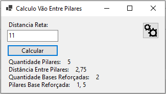
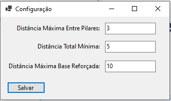
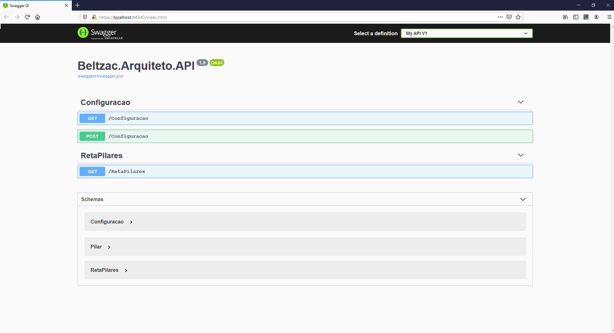

# Arquiteto
Teste para a Certsys

### Tecnologias

Web Forms
Injeção de Dependencia
Domain Driven Design
Api Rest

### Considerações

Não entendi muito o processo de fazer os calculos em outro processo, não que eu não saiba o que é ou pra que serve, mas no exercicio me pareceu estranho. Para um exemplo onde eu uso o Kafka para processamento de filas vide https://github.com/Beltzac/microsservicos-bari.

Para compensar fiz uma api web, onde poderia ser reutilizada caso a aplicação web fosse migrada para um app Android por exemplo.

Certamente seria uma situação onde conversaria com o time para entender melhor a situação.

### To Do (Coisas que eu sei que estão faltando)

Nomecraturas e padrões não estão ideais
Faltou acesso ao banco para gravar as configurações
Tratamento de erros
Spinner enquanto estiver esperando a api
Validações de dados
Telas ainda estão feinhas
Separar os modelos da api e do dominio (no DDD o ideal é isolar o dominio, da forma que está alterações no modelo do domain afetam a api)
Injeção de Dependência no Web Forms???? (tentei, mas está me parecendo que não suporta)

### Imagens

